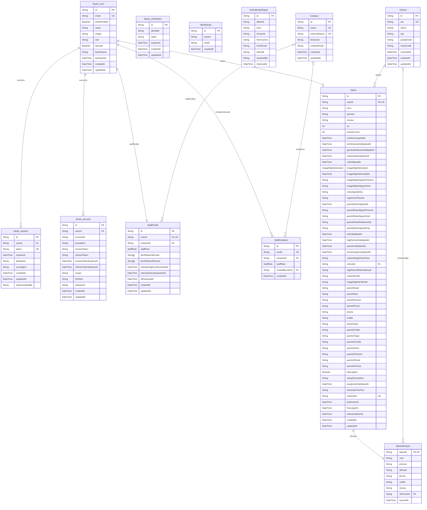
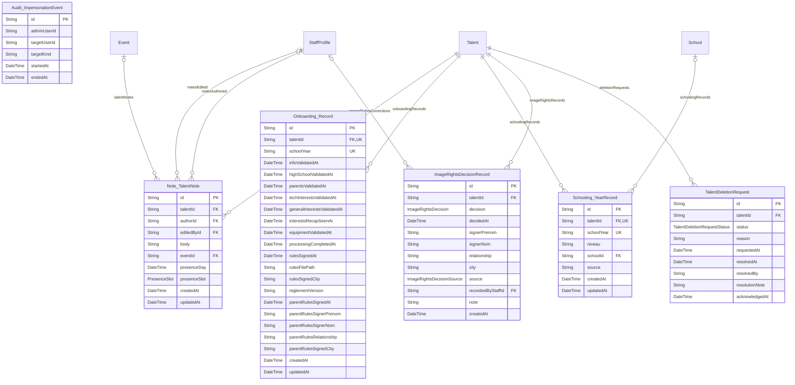
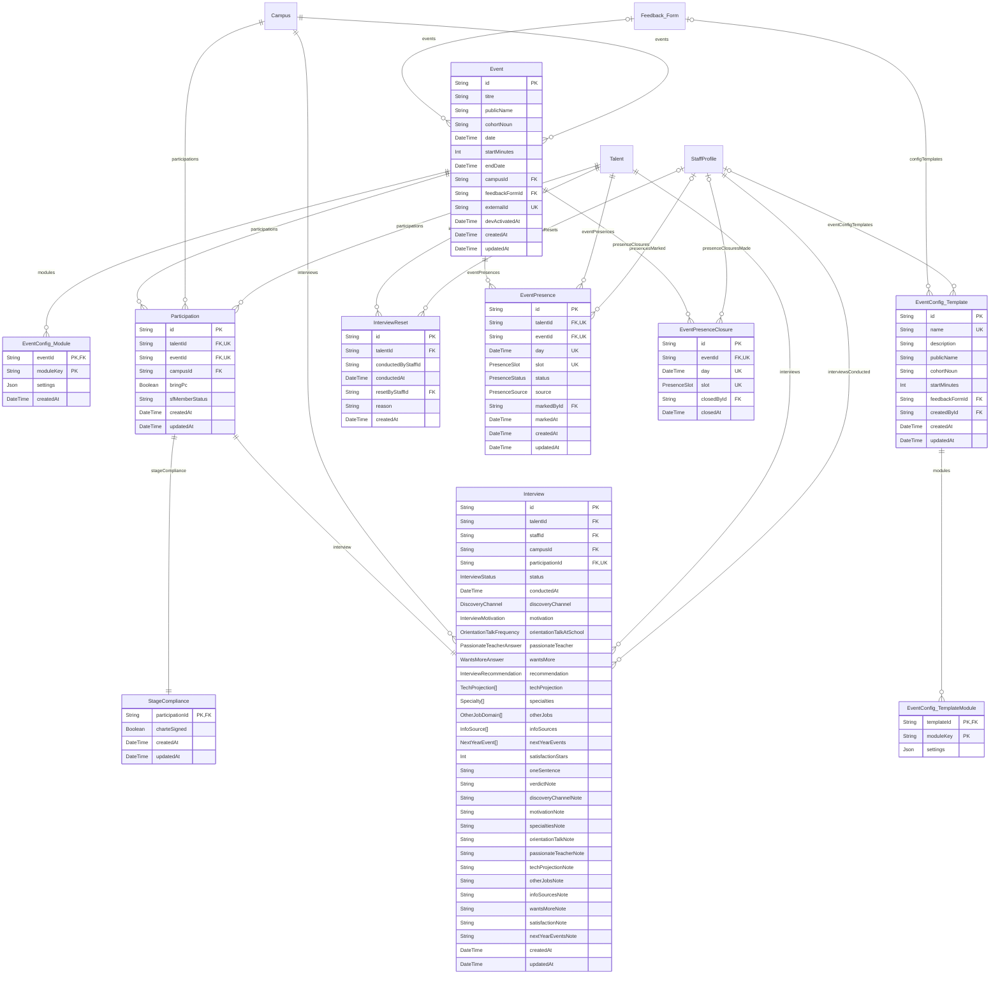
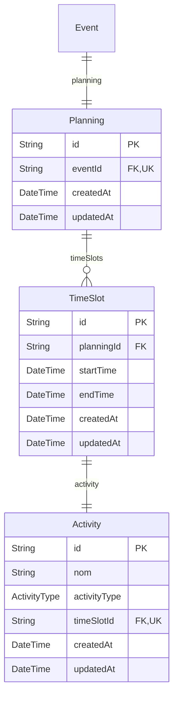
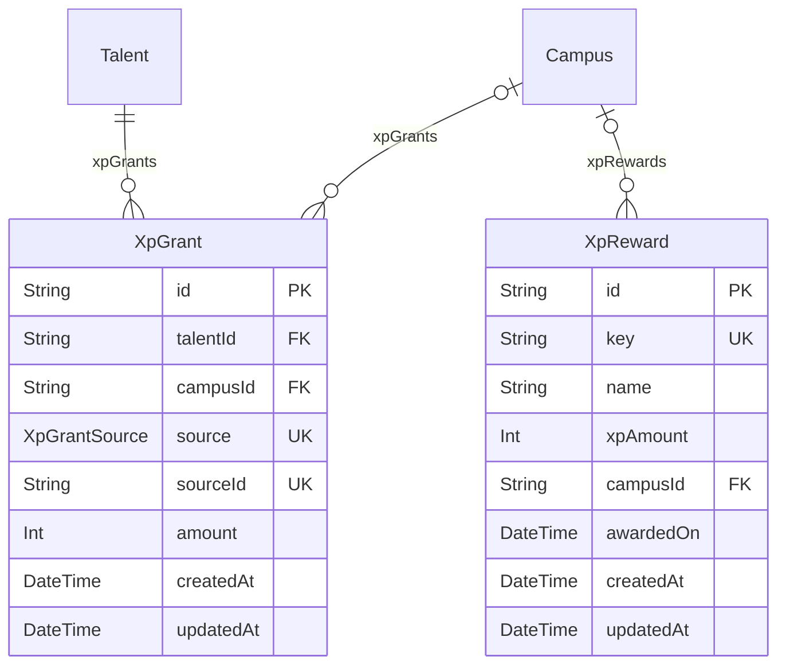
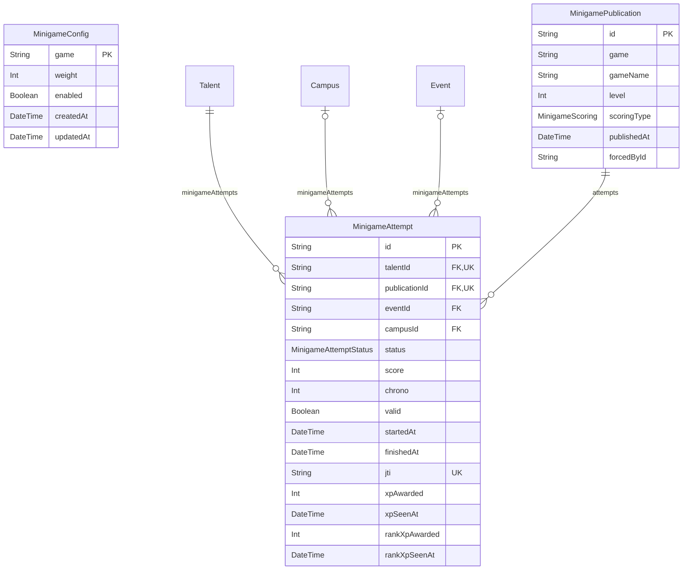
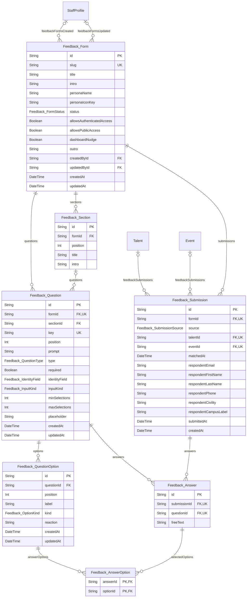
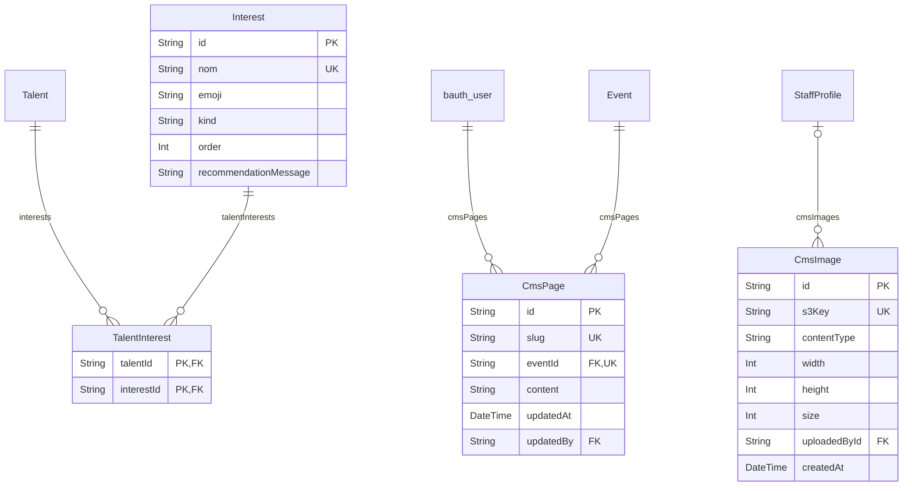
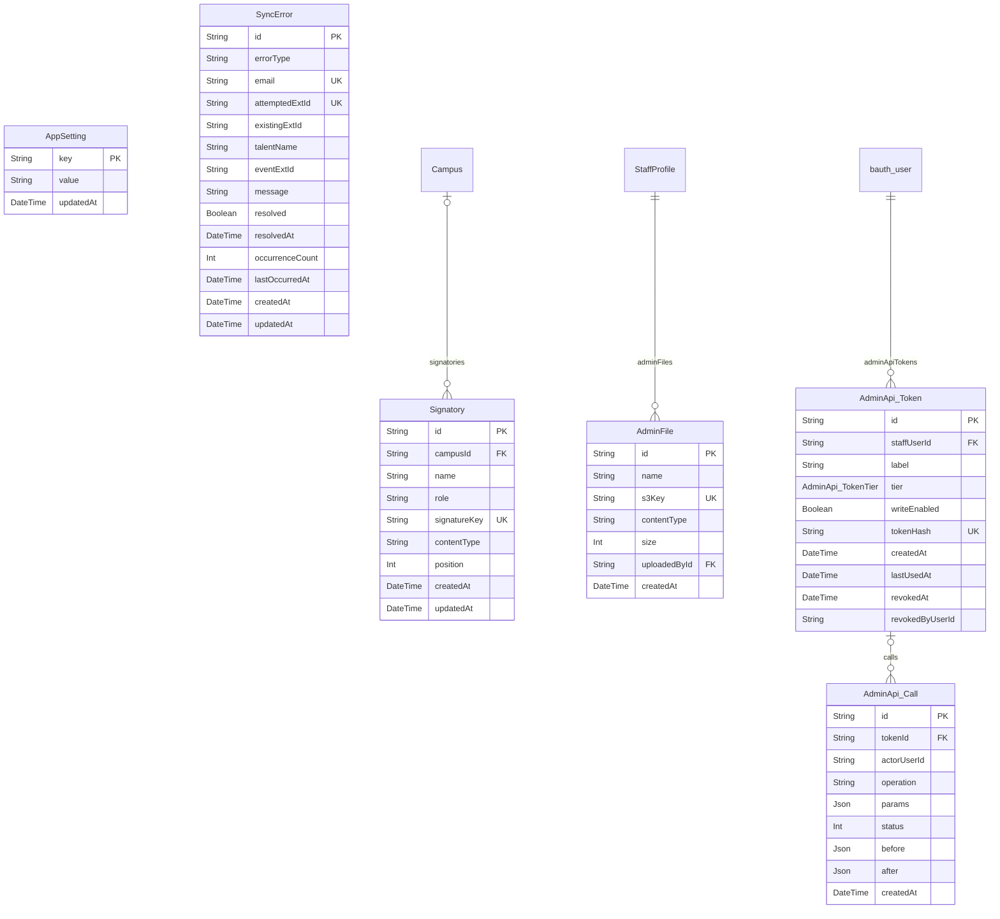

# Carte de la base de données

> Généré automatiquement par `bun run db:erd` depuis `prisma/schema.prisma`.
> **Ne pas éditer à la main** — toute modification est écrasée à la régénération.
> Le diff git de ce fichier = le journal lisible des changements de schéma.

## Vue d'ensemble

- **58** modèles · **35** enums · **85** relations

| Domaine | Modèles |
| --- | ---: |
| Authentification & Profils | 12 |
| Cycle de vie talent & RGPD | 6 |
| Événements & Participations | 10 |
| Planning & Activités | 3 |
| Progression, Portfolio & XP | 2 |
| Minijeux | 3 |
| Feedback | 7 |
| Communication & Support | 5 |
| Contenus & Centres d'intérêt | 4 |
| Configuration & Système | 6 |

## 1 · Authentification & Profils

## 2 · Cycle de vie talent & RGPD

## 3 · Événements & Participations

## 4 · Planning & Activités

## 5 · Progression, Portfolio & XP

## 6 · Minijeux

## 7 · Feedback

## 8 · Communication & Support

## 9 · Contenus & Centres d'intérêt

## 10 · Configuration & Système

