# Carte de la base de données

> Généré automatiquement par `bun run db:erd` depuis `prisma/schema.prisma`.
> **Ne pas éditer à la main** — toute modification est écrasée à la régénération.
> Le diff git de ce fichier = le journal lisible des changements de schéma.

## Vue d'ensemble

- **82** modèles · **38** enums · **137** relations

| Domaine | Modèles |
| --- | ---: |
| Authentification & Profils | 12 |
| Cycle de vie talent & RGPD | 3 |
| Événements & Participations | 12 |
| Planning & Activités | 10 |
| Référentiel de compétences | 15 |
| Progression, Portfolio & XP | 3 |
| Minijeux | 3 |
| Feedback | 7 |
| Communication & Support | 8 |
| Contenus & Centres d'intérêt | 4 |
| Configuration & Système | 5 |

## 1 · Authentification & Profils

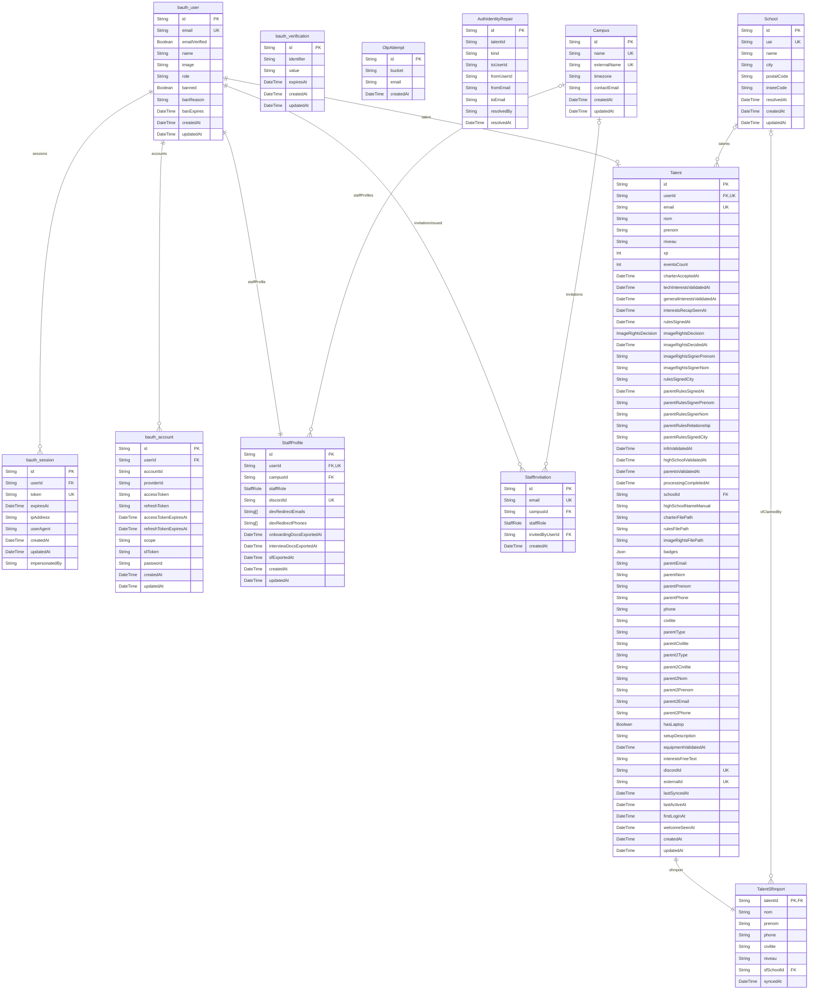

## 2 · Cycle de vie talent & RGPD

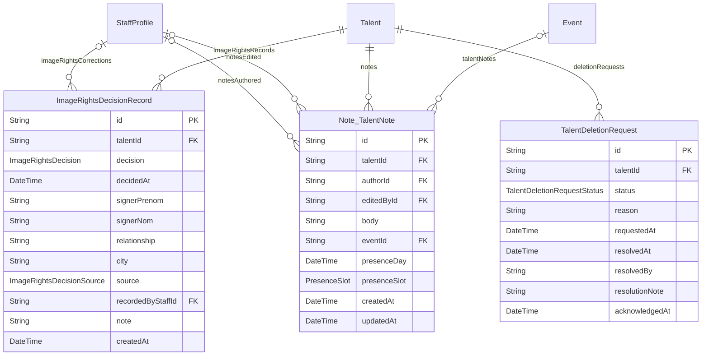

## 3 · Événements & Participations

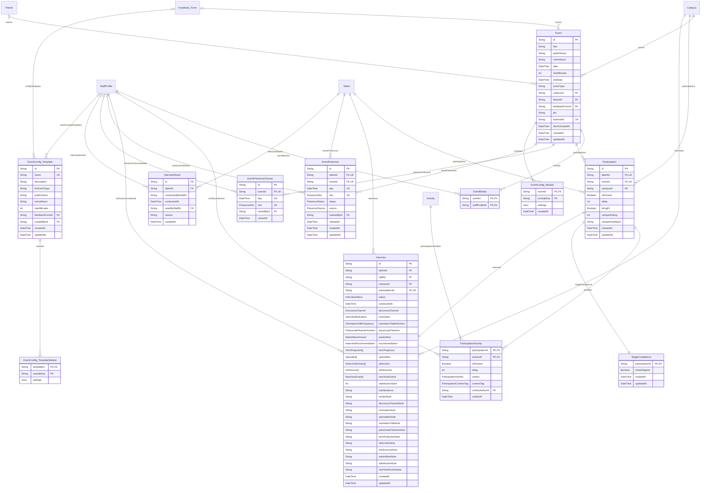

## 4 · Planning & Activités

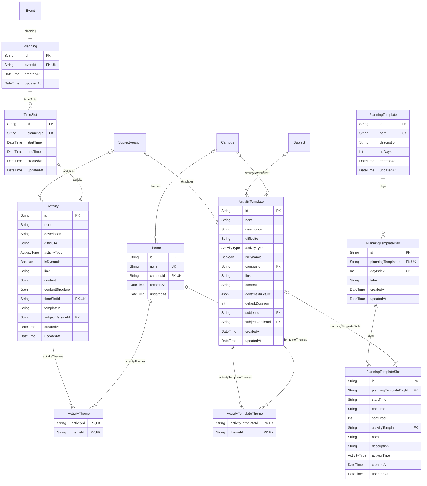

## 5 · Référentiel de compétences

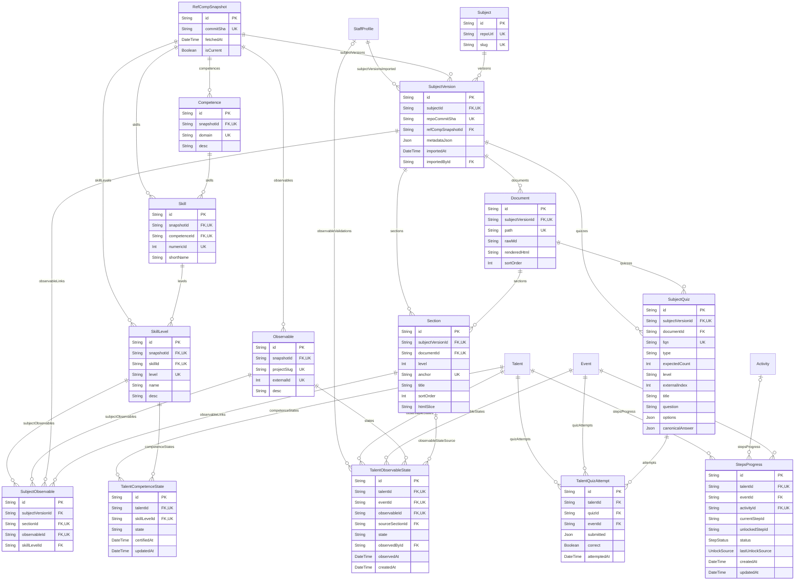

## 6 · Progression, Portfolio & XP

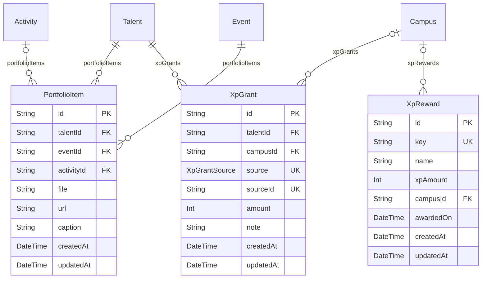

## 7 · Minijeux

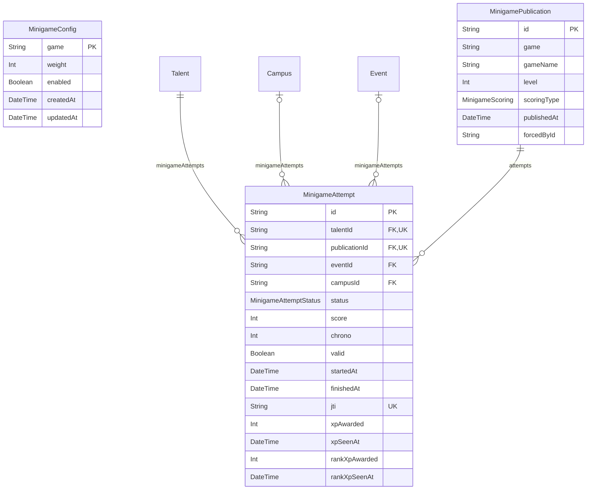

## 8 · Feedback

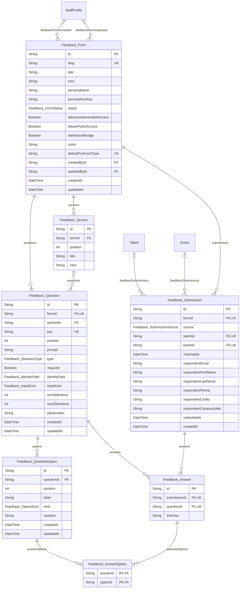

## 9 · Communication & Support

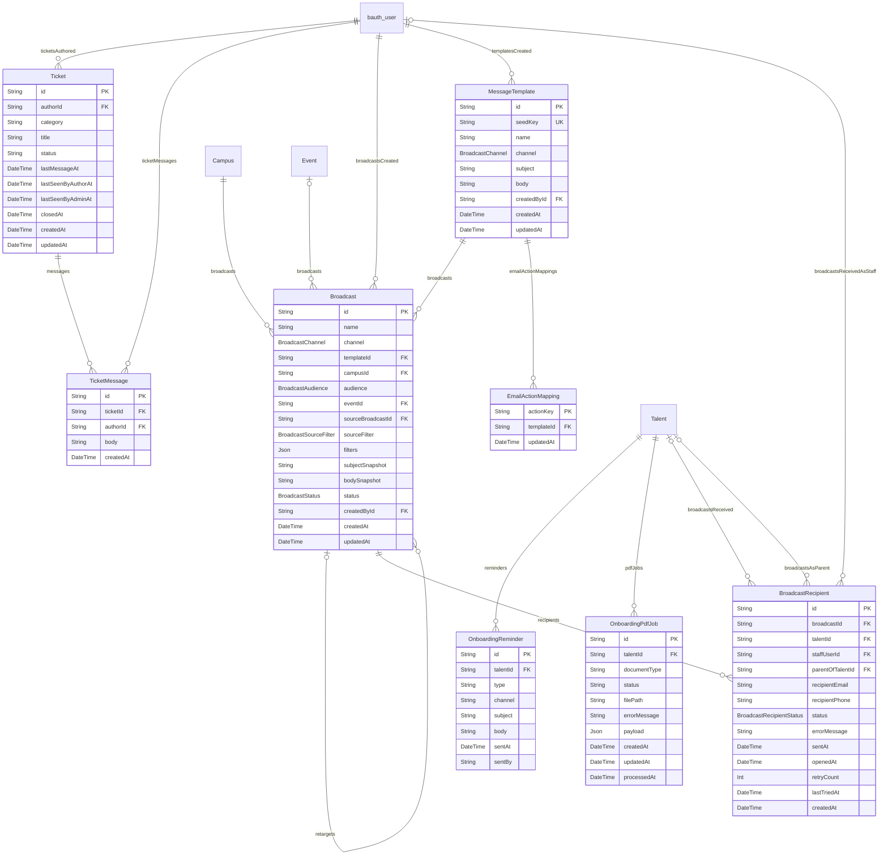

## 10 · Contenus & Centres d'intérêt

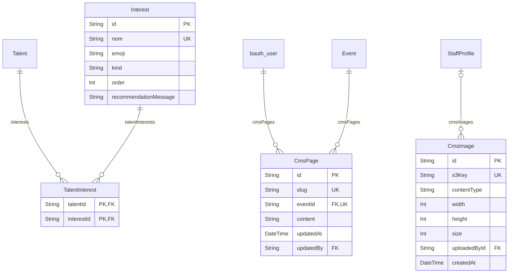

## 11 · Configuration & Système

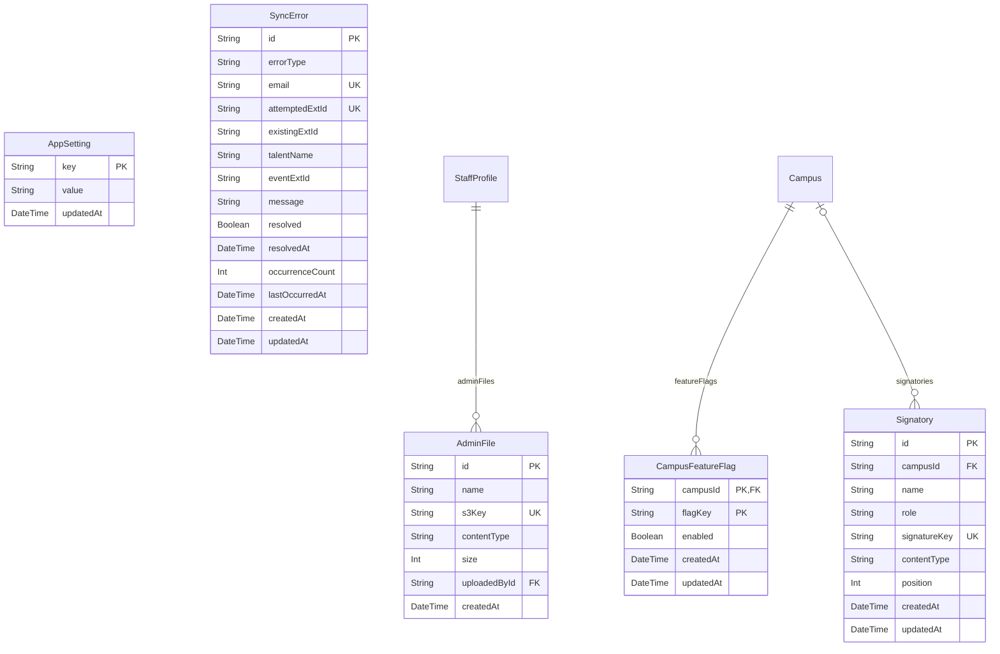
